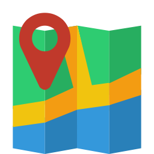

# ReactMap

*Experimental* Webapp to search address made with React

<p align="center">
  
</p>

This app is created with Create React App, a official by Facebook tool to start new projects. Look more of Create React App in the [official website](https://facebook.github.io/react/blog/2016/07/22/create-apps-with-no-configuration.html) or [here](https://www.fullstackreact.com/articles/using-create-react-app-with-a-server/#enter-create-react-app).

<p>
  
  ReactMap is Responsive!
</p>

## How to run

Clone this repo with following command:

```
git clone https://github.com/woliveiras/reactmap.git
```

Install all dependencies:

```
cd reactmap
npm i
```

Run local server:

```
npm start
```

The browser will be open with ReactMap loaded!

<p align="center">
  
</p>

## Building the project

To build the ReactMap project run following command:

```
npm run build
```

Will be created a folder named `build` optimized for production.

That's all folks
